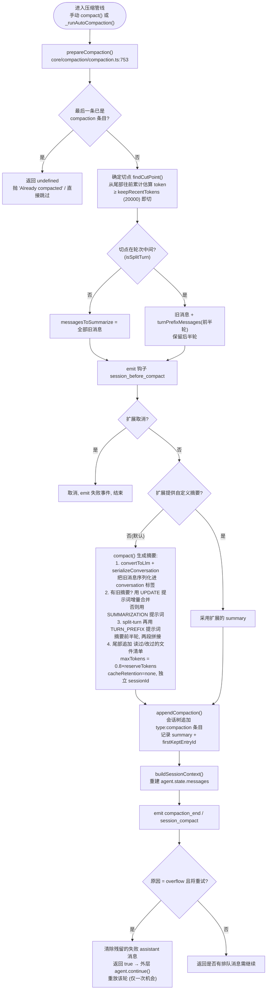
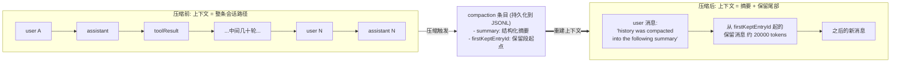
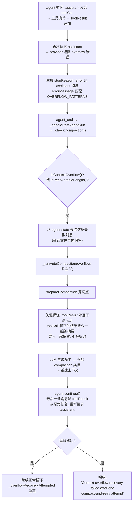

# Pi 上下文压缩机制解析

基于 [pi](https://github.com/earendil-works/pi-mono) 源码（`packages/coding-agent` 与 `packages/agent`）对上下文压缩（compaction）机制的分析笔记，覆盖：触发时机、触发流程、压缩方法、具体操作、压缩前后上下文对比、工具输出截断机制、上下文溢出时的"压缩 + 重试"恢复流程。

---

## 0. 架构总览

pi 的压缩引擎有两份近乎相同的实现：

| 副本 | 位置 | 使用方 |
|---|---|---|
| coding-agent 版 | `packages/coding-agent/src/core/compaction/compaction.ts` | pi CLI 的 `AgentSession`（本文主线） |
| agent-harness 版 | `packages/agent/src/harness/compaction/compaction.ts` | `AgentHarness`（SDK 场景） |

触发与编排逻辑位于 `packages/coding-agent/src/core/agent-session.ts`，核心算法（切点选择、摘要生成）位于 `core/compaction/`。

---

## 1. 触发时机

压缩由 **token 阈值**驱动，没有消息条数条件。共 5 条触发路径：

| # | 路径 | 触发点 | 位置 |
|---|---|---|---|
| ⓪ | 手动 | `/compact [额外指示]` 命令 | `modes/interactive/interactive-mode.ts:3082` → `AgentSession.compact()` |
| ① | 阈值检查（run 结束后） | `agent_end` 后 `_handlePostAgentRun()` → `_checkCompaction()` | `core/agent-session.ts:1122-1142` |
| ② | 阈值检查（提交新 prompt 前） | `prompt()` 内再查一次，兜住上次被 abort 的回复 | `agent-session.ts:1254` |
| ③ | 多轮工具循环中每轮响应前 | `prepareNextTurnWithContext` 钩子 → `_compactBeforeNextAssistantResponse()` | `agent-session.ts:543-569`，agent 侧调用点 `packages/agent/src/agent-loop.ts:177` |
| ④ | 上下文溢出恢复 | 回复报 overflow 错误或可恢复的 length 截断 | `_checkCompaction()` 中 `isContextOverflow()` / `isRecoverableLength()`（`packages/ai/src/utils/overflow.ts:134,171`） |

核心判定函数（`core/compaction/compaction.ts:235`）：

```ts
export function shouldCompact(contextTokens, contextWindow, settings): boolean {
    if (!settings.enabled) return false;
    return contextTokens > contextWindow - settings.reserveTokens;
}
```

默认设置（`core/settings-manager.ts:829-848`）：

- `reserveTokens: 16384` —— 为摘要请求和输出预留的空间
- `keepRecentTokens: 20000` —— 压缩后保留的近期 token 量
- `enabled: true`

token 用量优先取 provider 真实 usage（`calculateContextTokens` = `input+output+cacheRead+cacheWrite`）；无 usage 时用字符数启发式估算（约 4 字符 = 1 token，图片按 4800 字符计，见 `estimateTokens`）。

---

## 2. 触发流程

关键类/函数链：

1. **检测**：`AgentSession._checkCompaction(assistantMessage)`（`agent-session.ts:2126`）区分三种情况：
   - **overflow + 可重试**（回复是 error/length 截断）：移除失败的 assistant 消息 → `_runAutoCompaction("overflow", willRetry=true)`，压缩后重试该轮一次（`_overflowRecoveryAttempted` 保证只重试一次）；
   - **overflow + 已完成回复**：只压缩不重试；
   - **阈值**：`shouldCompact()` 为真 → `_runAutoCompaction("threshold", false)`。

   防抖细节：跳过 abort 的消息；换模型后旧模型的 overflow 不触发；上次压缩前的陈旧 usage 不触发（避免刚压缩完立刻再压缩）。

2. **执行**：`_runAutoCompaction(reason, willRetry)`（`agent-session.ts:2243`）与手动 `compact()`（`agent-session.ts:1940`）走同一条管线：

```
prepareCompaction()                     // core/compaction/compaction.ts:753，算切点
  → extension 钩子 session_before_compact   // 可取消或用自定义摘要替换
  → compact()                           // core/compaction/compaction.ts:933，LLM 生成摘要
  → sessionManager.appendCompaction()   // 持久化 compaction 条目
  → buildSessionContext() → 重建 agent.state.messages
  → emit compaction_end / session_compact
  → overflow 时返回 true，外层调 agent.continue() 重试
```

---

## 3. 压缩方法

**LLM 结构化摘要 + 切点裁剪**，不是简单截断，也无外部存储。

### 3.1 切点选择 `findCutPoint()`

`core/compaction/compaction.ts:402`。算法：从最新条目往前累计估算 token，累计 ≥ `keepRecentTokens`（20000）即停，在附近找合法切点。

- 合法切点是 user / assistant / bashExecution / custom / branchSummary / compactionSummary 消息，**绝不能是 toolResult**（保证工具调用与结果不拆散）；
- 尽量不把一轮对话从中间切开；若必须切则记下 `turnStartIndex`（`isSplitTurn=true`）。

### 3.2 准备阶段 `prepareCompaction()`

`core/compaction/compaction.ts:753`。产出：

- `messagesToSummarize`：将被摘要并丢弃的旧消息；
- `turnPrefixMessages`：split-turn 时被切开的前半轮；
- `previousSummary`：上一次 compaction 条目的摘要，用于**增量更新**而非重新摘要；
- `fileOps`：从旧消息中提取的文件读写记录（含上次 compaction 累积的）。

### 3.3 摘要生成 `compact()`

`core/compaction/compaction.ts:933`。

- 对话经 `convertToLlm` + `serializeConversation` 序列化为纯文本，包在 `<conversation>` 标签中发给模型，系统提示 `SUMMARIZATION_SYSTEM_PROMPT` 明确要求"只输出摘要，不要继续对话"；
- 固定结构模板 `SUMMARIZATION_PROMPT`：`## Goal / ## Constraints & Preferences / ## Progress (Done/In Progress/Blocked) / ## Key Decisions / ## Next Steps / ## Critical Context`，要求精确保留文件路径、函数名、报错信息；
- 有 `previousSummary` 时改用 `UPDATE_SUMMARIZATION_PROMPT`（`<previous-summary>` 标签 + 合并规则），实现多次压缩的滚动更新；
- split-turn 额外用 `TURN_PREFIX_SUMMARIZATION_PROMPT` 对前半轮单独摘要，再拼成 `history + "---" + Turn Context (split turn)`；
- 摘要 `maxTokens = 0.8 × reserveTokens`（前半轮为 0.5×）；摘要请求 `cacheRetention: "none"` 且用独立 sessionId，避免污染主对话的 prompt cache；
- 最后在摘要尾部追加本次压缩范围内**读过/改过的文件清单**（`formatFileOperations`）。

---

## 4. 具体操作

按 `_runAutoCompaction()` / `compact()` 中的执行顺序：

1. **对消息历史的处理**：原消息**不删除**，仍完整留在 session JSONL 文件中；只是构建上下文时被排除。
2. **持久化**：`sessionManager.appendCompaction(summary, firstKeptEntryId, tokensBefore, details, ...)`（`core/session-manager.ts:1097`）在会话树上追加一条 `type: "compaction"` 条目，记录 `firstKeptEntryId`（保留段的起点）。
3. **重建上下文**：`buildContextEntries()`（`session-manager.ts:417`）——有 compaction 时上下文 = `[compaction 条目] + 从 firstKeptEntryId 起的保留条目 + compaction 之后的新条目`，更早的旧条目全部省略。
4. **摘要注入方式**：compaction 条目经 `createCompactionSummaryMessage`（`core/messages.ts:109`）转成一条 `compactionSummary` 消息，再由 `convertToLlm`（`core/messages.ts:176`）包装成一条 **user 消息**：

   ```ts
   case "compactionSummary":
       return { role: "user", content: [{
           type: "text",
           text: COMPACTION_SUMMARY_PREFIX + m.summary + COMPACTION_SUMMARY_SUFFIX,
       }], ... };
   // PREFIX = "The conversation history before this point was compacted
   //           into the following summary:" + <summary> 标签
   ```

5. **对系统提示的处理**：**不动**。每轮由 `prepareNextTurnWithContext`（`agent-session.ts:558`）重新套用 `this._baseSystemPrompt`，压缩只影响 messages 数组。
6. **更新运行时状态**：`this.agent.state.messages = sessionContext.messages`，并计算 `estimatedTokensAfter`；emit `compaction_start` / `compaction_end` 事件供 UI 展示。
7. **溢出恢复**：压缩后若 `willRetry`，把残留的 error/length assistant 消息从 state 再删一次，返回 `true` 让外层 `agent.continue()` 重放该轮（每个 run 只允许一次）。

---

## 5. 流程图

### 图 1：触发判定（何时压缩）

```mermaid
flowchart TD
    subgraph 检测点1["检测点 ①: agent_end 后 (_handlePostAgentRun)"]
        A[一轮对话结束] --> B{_checkCompaction<br/>分析最后一条 assistant 消息}
    end
    subgraph 检测点2["检测点 ②: 提交新 prompt 前 (prompt 内部)"]
        C[用户提交新 prompt] --> B
    end
    subgraph 检测点3["检测点 ③: 多轮循环每轮响应前"]
        D[工具循环中<br/>prepareNextTurnWithContext] --> E{shouldCompact?<br/>用量 > 窗口 - 16384?}
    end
    subgraph 手动["检测点 ⓪: 手动"]
        M["/compact 指令"] --> N["AgentSession.compact()"]
    end

    B --> F{是 overflow 错误<br/>或可恢复 length 截断?<br/>isContextOverflow / isRecoverableLength}
    E --> G{shouldCompact?<br/>用量 > 窗口 − reserveTokens?}
    F -- 是 --> H{回复已完整?<br/>stopReason == stop?}
    F -- 否 --> G
    H -- "是(已完成)" --> I["_runAutoCompaction(overflow, 不重试)"]
    H -- "否(可重试)" --> J{已重试过一次?}
    J -- 是 --> K[报错放弃<br/>compaction_end + 失败事件]
    J -- 否 --> L[从 state 移除失败消息<br/>→ _runAutoCompaction(overflow, 将重试)]
    G -- 是 --> m["_runAutoCompaction(threshold, 不重试)"]
    G -- 否 --> Z[不压缩, 正常继续]
    N --> P(进入图 2 执行管线)
    I --> P
    L --> P
    m --> P
```

### 图 2：执行管线（手动与自动共用）



### 图 3：上下文重建效果（压缩前 vs 压缩后）



三条关键不变量：

1. **原始历史不销毁**——压缩只改变"送入模型的上下文"，JSONL 会话文件里的旧消息原样保留（可回溯、可分支）。
2. **系统提示不动**——每轮重新套用 `_baseSystemPrompt`，压缩只替换 messages 数组的头部。
3. **摘要是一条 user 消息**——放在上下文最前面，由 `compactionSummary` 消息经 `convertToLlm` 加 `<summary>` 前后缀包装而成。

---

## 6. 工具输出截断机制（第一道防线）

当 AI 回答调用工具、工具返回大量文本时，pi 先在**源头截断**，超限内容根本不会进入上下文。

### 6.1 内置工具的输出限制

实现在 `core/tools/truncate.ts`，默认 `DEFAULT_MAX_LINES = 2000`、`DEFAULT_MAX_BYTES = 50KB`：

| 工具 | 限制 | 策略 |
|---|---|---|
| `read` | 2000 行 / 50KB（先到为准） | `truncateHead` 保留开头，提示用 offset 继续读 |
| `bash` | 2000 行 / 100KB | `truncateTail` 保留**末尾**（错误通常在末尾），完整输出写入临时文件，消息里注明 `[Output truncated. Full output: <path>]` |
| `grep` | 每行匹配截断到 500 字符 | 行级截断 |
| `ls` / `find` | 条目数 / 50KB | 附加可操作的警告信息 |

截断不是静默的：工具结果里会带说明（还剩多少行、如何继续），模型知道自己看到的是部分数据。

### 6.2 上下文溢出时的"压缩 + 重试"恢复流程（第二道防线）

如果累积的上下文仍然超出窗口（比如几十轮对话 + 大量工具结果），下一次 assistant 请求会被 provider 拒绝，此时进入自动恢复：



关键细节：

1. **溢出检测**（`packages/ai/src/utils/overflow.ts:134` `isContextOverflow`）识别三种形态：
   - 错误消息匹配 `OVERFLOW_PATTERNS` 正则；
   - z.ai 式静默溢出：`input + cacheRead > contextWindow` 但 `stopReason = stop`；
   - 小米 MiMo 式截断：`stopReason = length` 且 `output = 0` 且输入填满窗口（≥ 99%）。
   另有 `isRecoverableLength` 处理输出被 `maxTokens` 截断的情况。

2. **失败消息被移除再重试**（`agent-session.ts` Case 1）：失败的 assistant 消息从运行时 state 删掉（持久化保留），这样最后一条消息是 `toolResult`，恰好满足 `agent.continue()` 的前置条件（`packages/agent/src/agent.ts:361`："last message must be a user or tool-result message"）——于是从工具结果处继续，而不是重放整轮。

3. **只重试一次**：`_overflowRecoveryAttempted` 标志保证不会无限"压缩 → 重试"循环。第二次失败就直接报错让用户介入。

4. **多轮循环中的即时检查**：长工具循环中，每轮 assistant 响应前 `_compactBeforeNextTurn` 会按阈值压缩，所以大多数情况走不到 overflow 恢复路径。

**一句话总结**：单次工具输出过大 → 源头截断（50KB / 2000 行），根本进不了上下文；整体上下文超限 → 把失败轮次的错误消息移除，触发一次 overflow 压缩（toolCall / toolResult 不拆散），然后从 toolResult 处自动续跑，仅重试一次。

---

## 7. 整体总结

pi 的上下文压缩流程：

**token 阈值/溢出检测**（`shouldCompact`：用量 > 窗口 − 16384，或 provider 报 overflow）→ **`prepareCompaction` 算切点**（从尾部保留约 20000 token，切点避开 toolResult 和轮次中间）→ **`compact()` 用同一个模型做一次独立 LLM 调用**，把旧对话序列化后生成固定结构（Goal/Progress/Decisions/Next Steps 等）的检查点摘要，多次压缩时增量合并旧摘要并附文件操作清单 → **追加 compaction 条目持久化**，重建上下文时用一条带前缀说明的 user 消息替换全部被压缩历史，系统提示与原始会话文件均不改动。溢出场景额外支持"压缩后自动重试一轮"的一次性恢复。

---

## 附录：关键文件索引

| 文件 | 职责 |
|---|---|
| `packages/coding-agent/src/core/agent-session.ts` | 触发检测（`_checkCompaction` / `_runAutoCompaction` / `compact`）、溢出恢复、扩展事件 |
| `packages/coding-agent/src/core/compaction/compaction.ts` | 核心算法：`shouldCompact` / `findCutPoint` / `prepareCompaction` / `compact` / 摘要提示词 |
| `packages/coding-agent/src/core/session-manager.ts` | 会话树、`appendCompaction`、`buildContextEntries` / `buildSessionContext` |
| `packages/coding-agent/src/core/messages.ts` | `convertToLlm`、`compactionSummary` 消息、`COMPACTION_SUMMARY_PREFIX/SUFFIX` |
| `packages/coding-agent/src/core/tools/truncate.ts` | 工具输出截断工具（`truncateHead` / `truncateTail`） |
| `packages/ai/src/utils/overflow.ts` | `isContextOverflow` / `isRecoverableLength` / `OVERFLOW_PATTERNS` |
| `packages/agent/src/agent-loop.ts` | 多轮循环中 `prepareNextTurn` 调用点 |
| `packages/agent/src/agent.ts` | `agent.continue()`（从 user / toolResult 消息恢复） |
